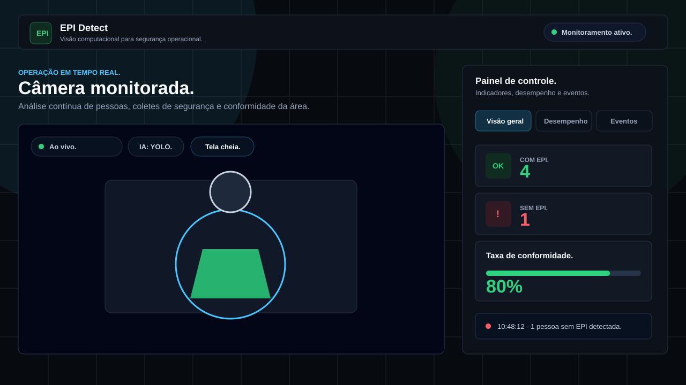
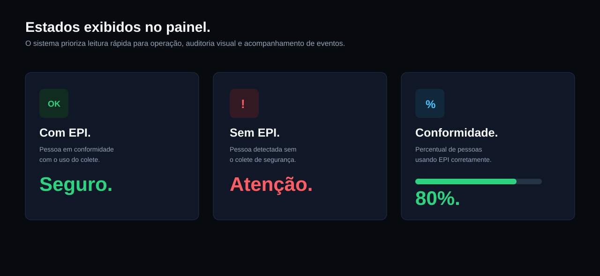
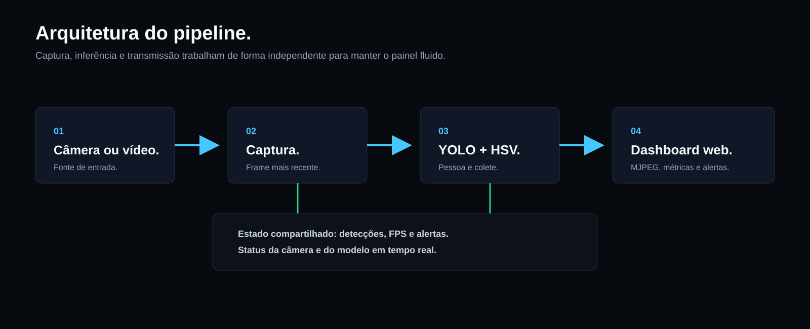

# EPI Detect

**EPI Detect** é um sistema de visão computacional em tempo real para apoiar o monitoramento do uso de coletes de segurança. A aplicação identifica pessoas na cena, analisa a região do torso e exibe os resultados em um dashboard web com alertas, métricas operacionais e histórico de detecções.

> **Status do projeto:** protótipo funcional. O classificador atual combina YOLO Pose com regras de cor em HSV. Ele deve ser usado como apoio operacional e não como mecanismo único de decisão em segurança do trabalho.



## Visão Geral

O objetivo do projeto é demonstrar como visão computacional pode apoiar rotinas de segurança em áreas operacionais, obras, galpões, plantas industriais e ambientes controlados. O painel foi pensado para leitura rápida: mostra quantas pessoas estão com EPI, quantas estão sem EPI, a taxa de conformidade, o desempenho do processamento e o horário dos eventos detectados.

## Principais Recursos

- Monitoramento por webcam, arquivo de vídeo ou vídeo demonstrativo.
- Detecção de pessoas com YOLO Pose.
- Análise visual da região do torso para identificar coletes fluorescentes.
- Verificação de cores laranja e amarelo-limão por regras HSV.
- Validação bilateral para reduzir falso positivo de colete visto apenas em um braço.
- Estabilização temporal para reduzir oscilações de classificação.
- Pipeline assíncrono para manter captura, inferência e transmissão mais fluidas.
- Dashboard web moderno com métricas, alertas, abas e opção de tela cheia.
- Log de eventos com horário da detecção.
- API local para integração com outros front-ends ou ferramentas internas.

## Dashboard

O dashboard web apresenta uma interface operacional com foco em clareza e tomada de decisão rápida.



No painel, a aplicação exibe:

- **Com EPI:** quantidade de pessoas em conformidade.
- **Sem EPI:** quantidade de pessoas detectadas sem colete de segurança.
- **Total de pessoas:** quantidade total de pessoas identificadas na cena.
- **Taxa de conformidade:** percentual de pessoas usando EPI.
- **Desempenho:** FPS da transmissão e FPS da detecção.
- **Eventos recentes:** horário e descrição das últimas detecções.

## Arquitetura

O projeto separa captura, inferência, renderização e API web para reduzir bloqueios entre as etapas do processamento.



Fluxo simplificado:

1. A câmera ou o vídeo fornece os frames de entrada.
2. A camada de captura mantém o frame mais recente disponível.
3. O detector executa YOLO Pose e aplica as regras de classificação do colete.
4. O renderizador desenha as marcações e gera o stream para o dashboard.
5. O Flask publica o vídeo, os indicadores e o status do sistema.

## Tecnologias Utilizadas

- **Python:** linguagem principal do projeto.
- **Flask:** servidor local e rotas da API.
- **OpenCV:** captura de vídeo, leitura de frames e codificação do stream.
- **Ultralytics YOLO:** detecção de pessoas e keypoints.
- **NumPy:** processamento numérico.
- **HTML, CSS e JavaScript:** dashboard web.

## Requisitos

- Python 3.10 ou superior.
- Webcam, arquivo de vídeo ou vídeo demonstrativo.
- CPU compatível. GPU não é obrigatória.
- Windows, Linux ou macOS com suporte às dependências do OpenCV.

## Instalação

Crie e ative um ambiente virtual:

```bash
python -m venv .venv
```

No Windows:

```bash
.venv\Scripts\activate
```

No Linux ou macOS:

```bash
source .venv/bin/activate
```

Instale as dependências:

```bash
python -m pip install -r requirements.txt
```

Na primeira execução, a biblioteca Ultralytics pode baixar automaticamente o peso oficial configurado em `MODEL_NAME`. Pesos `.pt` locais não são versionados no repositório.

## Como Executar

Dashboard com webcam:

```bash
python server.py --source webcam
```

Dashboard com vídeo demonstrativo:

```bash
python server.py --source demo
```

Dashboard com outro vídeo:

```bash
python server.py --source caminho/video.mp4
```

Dashboard com outra câmera:

```bash
python server.py --source 1
```

Depois de iniciar o servidor, acesse:

```text
http://localhost:5000
```

No Windows, o arquivo `iniciar.bat` oferece um menu para facilitar a execução.

## Modo Desktop

Também é possível executar o processamento em modo desktop:

```bash
python detect.py --source webcam
```

Para salvar um vídeo processado:

```bash
python detect.py --source demo --save resultado.mp4
```

## API Local

### `GET /video_feed`

Retorna o stream MJPEG usado pelo dashboard.

```html

```

### `GET /stats`

Retorna as métricas em tempo real.

```json
{
  "with_vest": 1,
  "without_vest": 0,
  "total": 1,
  "fps": 20,
  "det_fps": 5,
  "alert": false,
  "status": "running",
  "error": null
}
```

### `GET /health`

Informa a disponibilidade da câmera e do modelo.

Consulte [docs/API.md](docs/API.md) para o contrato completo da API.

## Configuração

Os principais ajustes ficam em [config.py](config.py):

- `INPUT_SIZE`: resolução usada pela IA.
- `DETECTION_INTERVAL`: intervalo entre inferências.
- `STREAM_FPS`: FPS alvo do dashboard.
- `TORCH_THREADS`: quantidade de threads reservadas ao PyTorch.
- `VEST_THRESH`: cobertura fluorescente mínima total.
- `VEST_SIDE_THRESH`: cobertura mínima em cada lado do torso.
- `ORANGE_*` e `YELLOW_*`: faixas HSV usadas para classificar o colete.

## Estrutura do Projeto

```text
EPI-Detect/
├── core/                 # Captura, detector e renderização.
├── templates/            # Dashboard web.
├── docs/                 # Documentação técnica e imagens do README.
├── demo/                 # Dados demonstrativos permitidos no Git.
├── dataset_epi/raw/      # Imagens locais ignoradas pelo Git.
├── models/               # Modelos locais opcionais ignorados pelo Git.
├── server.py             # Servidor Flask e pipeline assíncrono.
├── detect.py             # Execução em modo desktop.
├── config.py             # Configuração central.
└── tests/                # Testes automatizados.
```

## Privacidade e Segurança

- Não adicione imagens de pessoas ao repositório sem autorização.
- Não versione `.env`, credenciais, tokens, vídeos privados ou caminhos locais.
- Confirme autorização e política de retenção antes de capturar imagens em ambiente real.
- Revise pesos, vídeos e datasets antes de qualquer publicação.
- Use o sistema como apoio à operação, não como decisor único de segurança.

## Limitações Conhecidas

- A classificação de colete ainda depende de regras de cor, o que pode variar conforme iluminação, câmera, distância e tipo de EPI.
- Ambientes com baixa luz, reflexos ou obstruções podem gerar falsos positivos ou falsos negativos.
- Para uso produtivo, recomenda-se treinar ou validar um modelo específico com dados do ambiente real.
- O dashboard foi projetado para execução local. Para rede corporativa, revise autenticação, logs, retenção de imagens e infraestrutura.

## Testes

Execute as verificações principais:

```bash
ruff check .
ruff format --check .
pytest
```

Depois, execute o dashboard e confirme:

- `http://localhost:5000`
- `http://localhost:5000/video_feed`
- `http://localhost:5000/stats`
- `http://localhost:5000/health`

## Roadmap Sugerido

- Treinar um modelo dedicado para classes `com_epi`, `sem_epi` e `uso_incorreto`.
- Adicionar autenticação para uso em rede interna.
- Criar exportação de eventos em CSV ou banco de dados.
- Implementar painel histórico por período.
- Adicionar suporte a múltiplas câmeras.
- Integrar alertas com e-mail, Slack, Teams ou ferramentas internas.

## Licença

Este projeto está licenciado sob a licença MIT. Consulte [LICENSE](LICENSE) para mais detalhes.

